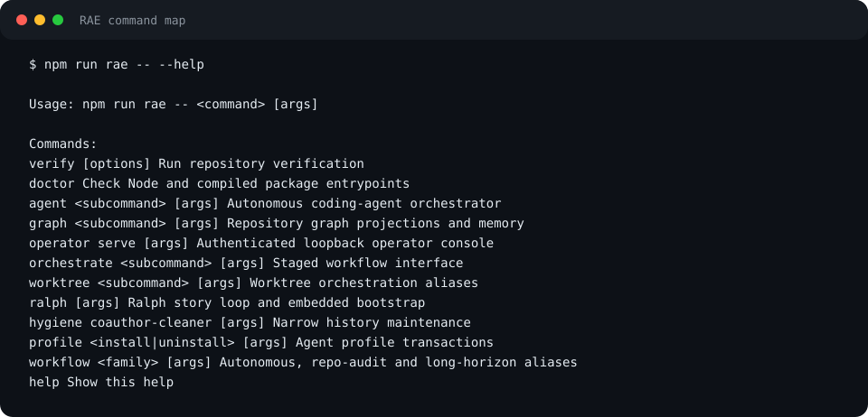
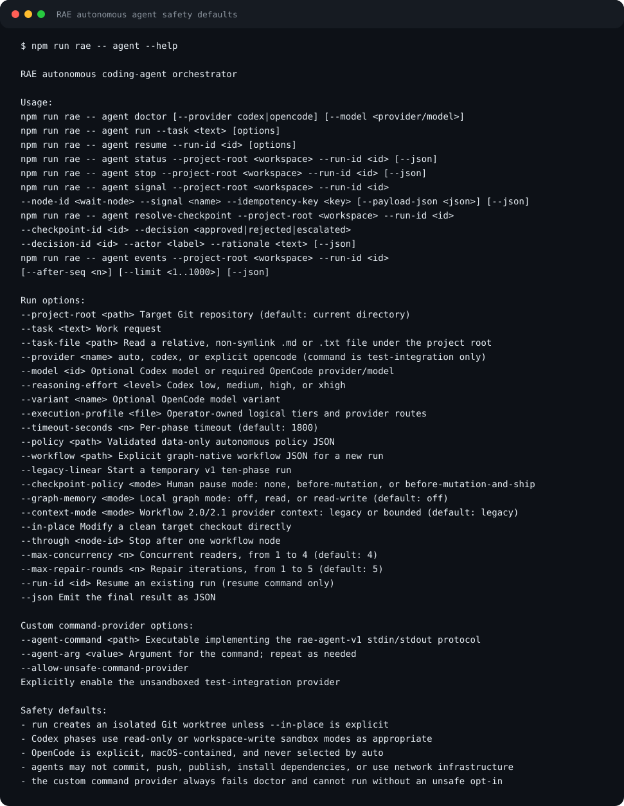

<p align="center">
  <picture>
    <source media="(prefers-color-scheme: dark)" srcset="docs/assets/brand/rae-lockup-dark.svg">
    <source media="(prefers-color-scheme: light)" srcset="docs/assets/brand/rae-lockup-light.svg">
    
  </picture>
</p>

[](https://github.com/sebastianspicker/rae-agent-workflows/actions/workflows/ci.yml)
[](https://www.bestpractices.dev/projects/13179)
[](https://scorecard.dev/viewer/?uri=github.com/sebastianspicker/rae-agent-workflows)
[](LICENSE)

RAE is a local-first toolkit for controlled repository changes. It combines
versioned graph workflows, isolated Git worktrees, schema-validated artifacts,
human checkpoints, verification gates, and durable local run evidence.

The repository distributes source only: there is no published package,
supported container, deployed service, or stable API. The hosted control-plane
code and workflow 2.2 are experimental.

## What RAE provides

- a graph-native workflow engine with bounded concurrency, joins, checkpoints,
  repair loops, and immutable attempt envelopes
- autonomous repository work in isolated Git worktrees, with Codex as the
  default provider and explicit macOS-only OpenCode routes
- a bearer-authenticated operator console bound to loopback
- a preregistered experiment runner: frozen task suites, interleaved arms,
  retained trial records, task-level uncertainty, missing-outcome coverage,
  benchmark cards and portable offline analysis bundles
- optional local repository, run, and temporal-memory graph projections
- the independent Ralph audit, linting, and transactional fixing loop
- deterministic quality, review, trace, profile-installation, and repository
  hygiene tools
- an experimental PostgreSQL control plane, remote worker, object-store
  boundary, and HTTP MCP endpoint

RAE does not commit, push, publish, deploy, or activate workflow revisions on a
user's behalf. The custom command provider is an unsandboxed test integration,
not an operational backend. OpenCode writes require an isolated RAE worktree
and the supported macOS Seatbelt boundary.

## Screenshot tour

These are deterministic CLI captures and sanitized operator fixtures, not
evidence from a live run.

The command surface prints the supported entry points and their arguments:



The agent help surface shows the sandbox and provider boundaries and the
`--checkpoint-policy` modes. `agent run` defaults to `before-mutation`, which
pauses for a human decision before the first writer; `before-mutation-and-ship`
also pauses at the release checkpoint before completion, and `none` never
pauses. Runs started from the operator console use `before-mutation-and-ship`.
The capture is regenerated from the CLI and may lag the current help text:



The loopback operator renders run state, gates, evidence references, and human
checkpoints. Its workflow editor authors revision-controlled workflows with
synchronized Loop, Graph, Analyze, and JSON views, a pinned active revision and
digest, and an inspector for budgets, loop bounds, and gate flags.


The same editor reflows for narrow windows:


Try the [static Pages demo](https://sebastianspicker.github.io/rae-agent-workflows/) to click
through the interface against an in-browser mock. It has no repository or
backend access. The full operator stays bearer-authenticated and loopback-only.
The documentation site is published under the same Pages site at
[`/rae-agent-workflows/docs/`](https://sebastianspicker.github.io/rae-agent-workflows/docs/).

## Requirements

- Node.js 24 or newer, npm and Git
- CMake and a C compiler for the native filesystem bridge
- the Codex CLI for provider-backed autonomous runs or Ralph
- the OpenCode CLI for explicitly selected OpenCode routes on macOS

## Prepare a source checkout

Run from the repository root:

```sh
npm ci --ignore-scripts
npm run build
npm run rae -- doctor
```

The build compiles strict TypeScript and the descriptor-relative filesystem
bridge. macOS requires the Xcode command-line tools; Linux requires CMake, Make
and a C compiler. Runtime commands execute compiled JavaScript.

The experimental platform has a separate lockfile and is outside the root npm
workspace. Install and build it when that package or the complete gate is in scope:

```sh
npm ci --prefix apps/platform --ignore-scripts
npm run build:platform
```

`npm run build:platform` runs the platform's own build
(`npm --prefix apps/platform run build`).

## Quick start

Inspect the supported command families:

```bash
npm run rae -- --help
npm run rae -- agent doctor
```

Run a task against a committed target repository in an isolated worktree:

```bash
npm run rae -- agent run \
  --project-root /path/to/target-repository \
  --checkpoint-policy before-mutation \
  --task "Add a tested health endpoint and document its behavior"
```

The command prints the worktree, run ID, and
`.pipeline/runs/<run-id>/run-report.md`. `before-mutation` is the CLI default
and is spelled out here for clarity: the run waits before the first writer
until the checkpoint is resolved with `agent resolve-checkpoint` or in the
operator. Use `--checkpoint-policy before-mutation-and-ship` to also pause
before completion, or `--through plan` to stop before a writer node. New
isolated runs use a `pipeline/<run-id>` branch and place the worktree under the
target repository's Git metadata at `.git/rae-worktrees/<run-id>`.

Run a preregistered experiment from `experiments/` (this calls the provider and
takes minutes per trial; add `--dry-run` to list the trials first):

```bash
npm run rae -- experiment validate --experiment experiments/clm-007-context-mode.experiment.json
npm run rae -- experiment run --experiment experiments/clm-007-context-mode.experiment.json
npm run rae -- experiment report --experiment experiments/clm-007-context-mode.experiment.json
```

Interrupted trials retain durable outcomes, and verified private evidence
archives survive workspace cleanup. Use `experiment verify-evidence` to check
retained bytes. See [Run an experiment](docs/how-to/run-an-experiment.md).

Serve the local operator for explicitly allowed repositories:

```bash
npm run rae -- operator serve --project /canonical/path/to/repository
```

Run Ralph after creating its package-local `prd.json`:

```bash
npm run rae -- ralph --check
npm run rae -- ralph --mode audit 10
```

`rae ralph` targets the Git top level of the directory it is invoked from. Inside
the RAE checkout its runtime state stays under `packages/ralph/.runtime`; in any
other repository it lives under `<repository>/.runtime/ralph` (`RALPH_STATE_DIR`).

See the [engine guide](packages/engine/README.md), [operator
guide](apps/operator/README.md), and [Ralph guide](packages/ralph/README.md) for
their complete interfaces.

## Repository map

| Path | Purpose and boundary | Documentation |
| --- | --- | --- |
| `packages/engine/` | Private npm workspace package; workflow, run, provider, graph, and evidence runtime | [Engine](packages/engine/README.md) |
| `packages/contracts/` | Private workspace package exporting immutable versioned schemas | [Contracts](packages/contracts/README.md) |
| `apps/operator/` | Private workspace application; loopback console and static mock demo | [Operator](apps/operator/README.md) |
| `apps/platform/` | Separately installed experimental control plane and worker | [Platform](apps/platform/README.md) |
| `packages/ralph/` | Independent TypeScript story loop | [Ralph](packages/ralph/README.md) |
| `packages/dev-tools/` | Independently invoked TypeScript quality, review, and trace tools | [Quality gate](packages/dev-tools/quality-gate/README.md), [review](packages/dev-tools/multi-model-review/README.md), [trace](packages/dev-tools/trace-collector/README.md) |
| `workflows/` | Repository-owned workflow definitions and recipes | [Graph tutorial](docs/tutorials/graph-engineering-with-rae.md) |
| `experiments/` | Frozen task suites and preregistered experiment designs (data) | [Experiments](experiments/README.md) |
| `integrations/agent-adapters/` | Adapter manifest, templates, generator, and derived runner guidance | [Adapter generation](integrations/agent-adapters/README.md) |
| `profiles/agent-environments/` | Sanitized profile templates and transactional installers | [Profiles](profiles/agent-environments/README.md) |
| `tools/repo-hygiene/` | Narrow repository-maintenance utilities | [History cleaner](tools/repo-hygiene/coauthor-trailer-cleaner/README.md) |
| `scripts/` | Umbrella CLI and repository-wide validation | [CLI reference](docs/reference/cli/umbrella.md) |

The [architecture guide](docs/ARCHITECTURE.md) describes dependency direction,
runtime flows, state ownership, and security boundaries. The [documentation
guide](docs/INDEX.md) routes readers into tutorials, how-to guides, references,
explanations, and governance.

## Configuration

Configuration is owned by the runtime that consumes it:

| Surface | Configuration entry point |
| --- | --- |
| Autonomous engine | CLI flags, `packages/engine/policies/`, workflow JSON, and optional execution profiles |
| Workflow registry and graph memory | Owner-controlled state under the target Git common directory |
| Operator | `--project`, repeatable `--execution-profile`, or remote-operator options |
| Ralph | `prd.json`, command flags, and documented `RALPH_*` variables |
| Experimental platform | `RAE_PLATFORM_CONFIG` TOML and worker environment variables |
| Public profiles | Sanitized templates under `profiles/agent-environments/` |

Do not put credentials or unrelated private material in tasks, policy files,
profiles, artifacts, reports, or committed examples. Provider-backed commands
transmit selected task and context data to the configured provider.

## Development and verification

Read [CONTRIBUTING.md](CONTRIBUTING.md) before changing behavior. The
public-checkout verification command is:

```bash
npm run verify -- --skip-install --skip-tests
```

The command builds the source, checks maintained TypeScript and documentation,
and exercises the runtime entry points. Test sources and fixtures are private,
gitignored local files; omit `--skip-tests` in a maintainer checkout containing them. Add
`--skip-build` to reuse an existing build. `npm run build` covers root
workspaces; build the platform separately with `npm run build:platform`.

The command ends with a verdict line. `VERDICT: PASS` means every step ran and
passed. `VERDICT: PARTIAL` means the steps that ran passed but some were
skipped: the platform steps when `apps/platform/node_modules` is absent, or the
documentation build with `--skip-docs`, or private tests with `--skip-tests`.
Public CI uses `--skip-tests`. `VERDICT: FAIL` is followed by the
command that failed.

With the private local tests present, `npm test` runs every workspace suite sequentially. When the platform is not
installed it prints `SKIPPED apps/platform: …` instead of failing. Individual
suites are `test:engine`, `test:operator`, `test:platform`, `test:ralph`,
`test:agent-profiles`, `test:coauthor-trailer-cleaner`,
`test:repository-tools`, `test:dev-tools`, and `test:fs-bridge`. Narrower
gates are `npm run check:architecture`, `npm run check:docs`,
`npm run check:adapters`, and `npm run format:check` (`npm run format` applies
the formatter).

For a complete verification run, from a clean maintainer worktree containing the private tests:

```bash
npm run verify -- --release-candidate
```

`--release-candidate` installs both lockfiles, cannot be combined with the skip
options, and fails when the worktree has uncommitted changes.

## Support, security, and license

Use [SUPPORT.md](SUPPORT.md) for usage questions and [SECURITY.md](SECURITY.md)
for private vulnerability reporting and trust boundaries. RAE is licensed under
the [MIT License](LICENSE).
