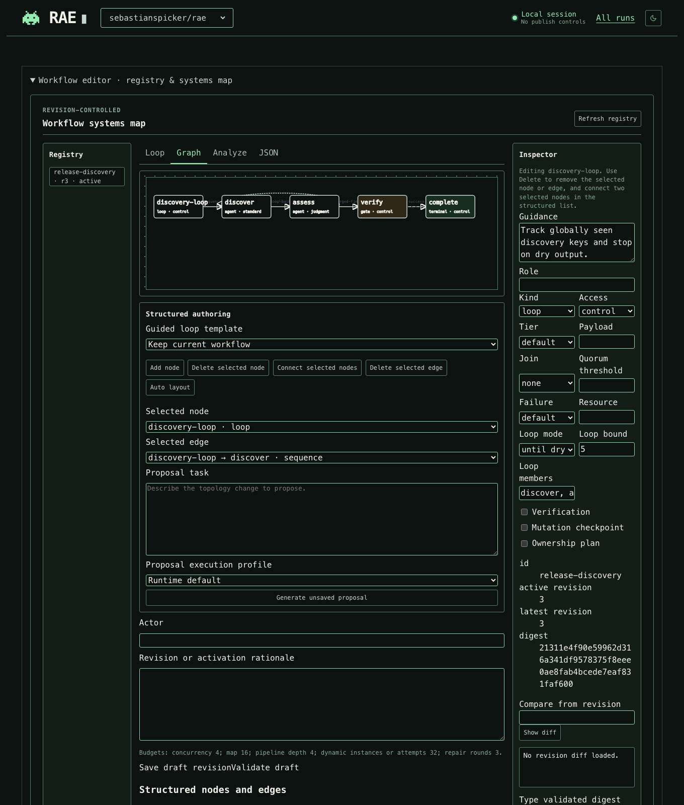
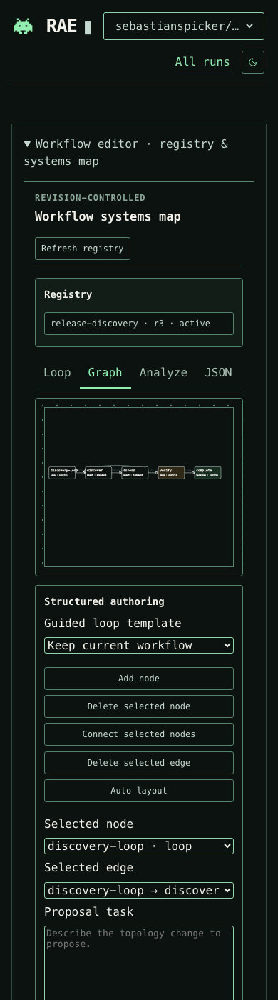

# RAE loopback operator console

The operator presents durable autonomous-run state under `.pipeline/`. It binds
only to `127.0.0.1`, uses an ephemeral port by default, and does not expose raw
provider traces. The terminal-inspired interface uses modular CSS and TypeScript
under `static/css/` and `static/js/`, compiled into `dist/static/`.

## Task and evidence review

The selected task places recorded evidence beside the human decision. The task
outline follows description, decision review, execution and result inspection;
it does not estimate progress or replace the workflow graph. Approval saves its
outcome and rationale. Resume is a separate action enabled by the server's
current run controls. Draft rationale survives background updates to the same
checkpoint. Start validates the task's 32 KiB UTF-8 limit before submission.

Completed runs retain references for local report and worktree-diff inspection.
Completion does not publish or release changes. Full gate, resource, event and
recovery controls remain under **Run details**; the complete revision-controlled
workflow editor remains under **Workflow editor**. **All runs** exposes the
catalogue, search, state filters and new-run form. `Ctrl+K` or `Cmd+K` opens run
search. Copy controls copy displayed references without reading local files.

The initial theme is dark; the theme control retains a previously chosen light
or dark preference when browser storage is available. Narrow windows stack
evidence before decisions. Status text, keyboard focus and labelled controls
remain available independently of the decorative pixel motif.

## Static Pages demo

The Pages demo is a real interactive browser surface using the same static UI,
but it is not the screenshot capture workflow. Its data, API responses, NDJSON
event stream, and mutations live only in the browser. It has no repository or
filesystem access, makes no backend API calls, and exposes no live or publish
controls.

The build also emits `demo/tour.html`, a screenshot tour of the workflow editor
at desktop and mobile widths. The demo banner links to it.

Build the static output into the safe default temporary directory:

```bash
npm --workspace @rae/operator run build:demo
```

Or provide a dedicated directory for a Pages upload or local static server:

```bash
npm --workspace @rae/operator run build:demo -- --out /tmp/rae-operator-pages
python3 -m http.server --directory /tmp/rae-operator-pages 8080
```

The build copies the real static assets, replaces the production entry module
with the demo bootstrap, rewrites root-relative assets for a Pages subpath, and
writes `.nojekyll`. Do not commit its generated output. The regular operator
entry remains bearer-authenticated, same-origin, and loopback-only.

## Screenshots

Sanitized layout captures use the maintained CSS and fixture data. They are not
evidence from a real run:





Regenerate both captures from the current operator UI and the sanitized graph
fixture:

```bash
npm --workspace @rae/operator run build
node apps/operator/dist/scripts/capture-docs-screenshots.js
```

The capture script requires a local Chrome or Chromium installation. It starts
an ephemeral loopback fixture server and does not read repository run state.
Each capture uses an isolated browser profile and
[explicit viewport dimensions](https://chromedevtools.github.io/devtools-protocol/tot/Emulation/#method-setDeviceMetricsOverride).
The script verifies the connected Graph view, browser errors, viewport size,
and page overflow before saving each PNG. It awaits browser process-group
cleanup and retains the temporary profile if containment cannot be confirmed.
Use `node apps/operator/dist/scripts/capture-docs-screenshots.js --check` to
verify both viewports with temporary images. The root verification gate uses
this mode so it does not change the maintained screenshots.

Start it with one or more canonical Git roots:

```bash
npm --workspace @rae/operator run build
node apps/operator/dist/server.js \
  --project /absolute/path/to/repository
```

The supported umbrella form is:

```bash
npm run rae -- operator serve --project /absolute/path/to/repository
```

Preload one or more server-owned execution profiles with repeatable
`--execution-profile <file>` arguments. Profile paths and credentials stay on
the server. The browser receives only sanitized IDs, routes, models, and
readiness.

The server prints one URL. Its 256-bit session token appears only in the URL
fragment. The app removes the fragment from browser history and keeps the token
in memory for bearer-authenticated API and event-stream requests.

## Remote upstream mode

To use the same local console with a separately hosted operator API, keep the
browser session on loopback and configure an upstream origin and an owner-only
credential file:

```bash
npm run rae -- operator serve \
  --remote-url https://operator.example \
  --token-file /absolute/path/to/operator-token
```

Remote mode cannot be combined with `--project`. The browser still reaches only
the ephemeral local URL and sends only its local session bearer. The server
reads the upstream bearer token from `--token-file` for every forwarded request;
it is never included in browser JavaScript, local API responses, or errors.

`--remote-url` must be an origin-only HTTPS URL. HTTP is accepted only for an
explicit loopback development origin. The token file must be a regular file
owned by the current user, with no group or world permissions; symlinks and
unsafe files are rejected. Token rotation therefore takes effect on the next
request without restarting the console.

Remote mode is a fixed API relay, not a general proxy. It rejects redirects and
forwards only the `/api/v1` methods used by this console, including the listed
run, event, control, and workflow-editor routes. Request bodies are limited to
64 KiB and upstream responses to 1 MiB.

## API

All `/api/v1` requests require the session bearer token and an exact loopback
`Host`. State-changing requests also require the exact loopback `Origin`.

- `GET /api/v1/projects`
- `GET /api/v1/projects/:projectId/execution-profiles`
- `GET|POST /api/v1/projects/:projectId/runs`
- `GET /api/v1/projects/:projectId/runs/:runId`
- `GET /api/v1/projects/:projectId/runs/:runId/events`
- `GET /api/v1/projects/:projectId/runs/:runId/events/stream`
- `POST .../:runId/stop`
- `POST .../:runId/resume`
- `POST .../:runId/interrupt`
- `POST .../:runId/checkpoint-decision`
- `POST .../:runId/cleanup`
- `GET /api/v1/projects/:projectId/workflows`
- `GET /api/v1/projects/:projectId/workflows/:workflowId`
- `GET|POST /api/v1/projects/:projectId/workflows/templates`
- `POST /api/v1/projects/:projectId/workflows/:workflowId/analysis`
- `POST /api/v1/projects/:projectId/workflows/:workflowId/proposals`
- `GET /api/v1/projects/:projectId/workflows/:workflowId/proposals/:jobId`
- `POST /api/v1/projects/:projectId/workflows/:workflowId/drafts`
- `GET /api/v1/projects/:projectId/workflows/:workflowId/diff`
- `POST /api/v1/projects/:projectId/workflows/:workflowId/revisions/:revision/validate`
- `POST /api/v1/projects/:projectId/workflows/:workflowId/revisions/:revision/activate`

Start accepts `task`, `checkpoint_policy`, and an optional preloaded
`execution_profile_id`. It never accepts a profile path. Interrupt and cleanup
require `confirm_run_id` to exactly match the selected run. A checkpoint
decision requires its opaque `checkpoint_id`, an opaque `decision_id`, one of
`approve`, `reject`, or `escalate`, and a non-empty `rationale`. The server
records the actor as `rae-loopback-operator`.

The console never accepts in-place execution, command providers, environment
overrides, raw trace access, forced cleanup, commit, push, or publish controls.
Cleanup delegates to the pipeline's ownership- and dirty-state-validating
worktree cleanup operation.

The workflow editor provides synchronized Loop, Graph, Analyze, and JSON views.
It compiles five guided templates to workflow 2.1, exposes keyboard-operable
node and edge controls, analyzes unsaved revisions, and loads validated proposal
jobs into the unsaved editor. Saving a revision and activating its exact digest
remain separate human actions. Workflow 2.0 and experimental 2.2 stay available
through the expert JSON view. Registry mutations are rejected while any
allowlisted project run is active.

Proposal creation is asynchronous. A request accepts only `task`, optional
`base_revision`, and optional `execution_profile_id`; task text is limited to
32 KiB and the in-memory queue holds at most 12 jobs. The result is validated
before it is returned to the editor. The proposal endpoint does not save a
revision, activate a digest, or start a run.

Run projections include bounded graph health counts when a projection exists:
availability, validation state, node and edge counts, stale-source count, and
stale-memory and unresolved-conflict counts. The API does not expose raw graph
records, absolute paths, prompts, provider metadata, or untrusted memory text.

Only one process started by a server instance may be active at once. Interrupt
signals that owned process group, records `interrupted` after it exits, and
removes an autonomous lock only when its recorded PID matches the owned child.
POSIX process groups cannot prove termination of a descendant that deliberately
creates a new session, so interrupt responses expose `containment_uncertain`;
inspect the workspace and provider activity before reusing an interrupted run.
Start defaults to checkpoints before both mutation and release.

## Verification

```bash
npm --workspace @rae/operator test
```

## Summary discovery and event replay

`GET /api/v1/projects/:projectId/runs?view=summary` returns identity, workspace
labels, status, phase and timing fields without gates, attempts, checkpoints or
graph-health projection. The default response remains the full run projection.
Run pages use opaque timestamp-and-ID keyset cursors, with pagination applied
before detail loading. The browser initially loads 100 summaries and offers
further pages without discarding the selected run. Legacy runs whose only start
timestamp is in their trace still read that trace to preserve ordering.

The console loads selected-run details separately. Event pages use physical
JSONL line cursors; incomplete appended lines wait for their newline, malformed
committed lines fail closed, and replacement or rewritten prefixes invalidate
the bounded sanitized cache. The 10,000-event limit still applies to the whole
trace. Cached reads keep the guarded-workspace checks. The browser drains every
historical page before subscribing. Reconnects resume from the last event
cursor, and animation-frame batches append stable rows while
retaining complete history, keyboard focus and expanded details. The static
demo uses the same summary/detail and replay flow.

Run `node scripts/dist/benchmarks/operator.js` (after `npm run build`) for three repetitions of the
100/1,000-run and 1,000/10,000-event workloads. It checks equivalent projections
and reports elapsed milliseconds, RSS changes, bytes read and parse/read counts
using disposable repositories. Timing is diagnostic, not a pass threshold.
