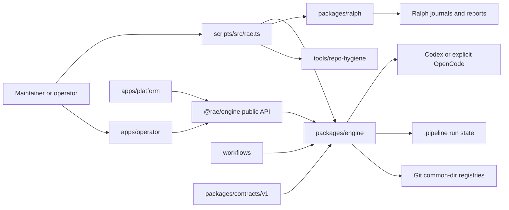
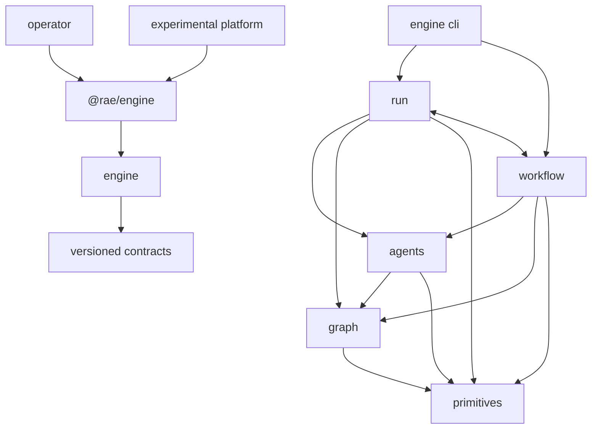

# Architecture

RAE is a local-first repository-automation system. Its reusable engine validates
versioned workflows and contracts, executes bounded work through provider
processes and deterministic tools, and records local evidence. Applications sit
outside the engine, Ralph retains an independent transaction model, and the
hosted platform remains an experimental adapter rather than a deployed RAE
service.

## Component model

| Component | Responsibility | Build or operation boundary |
| --- | --- | --- |
| `scripts/src/rae.ts` | Routes user commands to the owning runtime | Source-checkout entry point |
| `packages/engine/` | Workflows, scheduling, providers, run state, graph projection, gates, and evidence | Private root npm workspace package |
| `packages/contracts/v1/` | Versioned JSON Schemas crossing package and process boundaries | Private root workspace package; existing versions are immutable |
| `workflows/` | Committed workflow topology and policy | Engine-owned data, not executable provider code |
| `apps/operator/` | Authenticated loopback run and workflow interface | Private root workspace application |
| `apps/platform/` | PostgreSQL control plane, HTTP/MCP API, object storage, and remote worker | Experimental package with a separate lockfile |
| `packages/ralph/` | Story selection, read-only audit/lint, and recoverable fixing transactions | Independent TypeScript runtime |
| `packages/dev-tools/` | Deterministic quality, review, and trace processors | Root workspace packages invoked through JSON lines |
| `integrations/agent-adapters/` | Source templates, manifest, generator, and derived runner guidance | Generated-content boundary |
| `profiles/agent-environments/` | Sanitized profile templates and transactional installers | Independent filesystem-mutating tool |
| `tools/repo-hygiene/` | Narrow maintenance utilities | Independent tool; one utility rewrites Git history |

## Dependency direction

`packages/engine/src/public/index.ts` is the sole supported JavaScript import
surface. Everything else below `packages/engine/src/` is private. Applications
must not import engine source paths, and the engine must not depend on
applications, Ralph, profiles, maintenance tools, integrations, or developer
tool source paths. Executable tools used at runtime are declared package
dependencies. Inside the engine, imports follow the arrows above: `run/` and
`workflow/` are one layer, and `primitives/` depends on nothing else in the
engine.

## Autonomous run flow

1. The CLI resolves an explicit workflow, an activated local revision, or
   `workflows/graph-native-default.workflow.json`.
2. The workflow contract is canonicalized, schema-validated, digested, and
   copied into the run as an immutable snapshot.
3. The scheduler orders typed edges, caps read concurrency, serializes shared
   resources, and drains readers before an exclusive writer.
4. A provider worker receives the task, bounded predecessor context, node
   guidance, and an output schema. Each attempt uses a fresh provider session.
5. The engine validates the returned artifact and node envelope. Read nodes are
   checked for repository mutation; writer results are checked against the
   ownership plan and Git invariants.
6. Attempts, events, gates, checkpoints, traces, and the final report are
   written under `.pipeline/runs/<run-id>/`.
7. Optional graph projection derives queryable context from repository and run
   evidence. It never authorizes mutation or replaces raw artifacts and gates.

New autonomous runs use an isolated `pipeline/<run-id>` branch and worktree
under the target repository's Git metadata by default. The ten-stage v1 engine
is retained only for explicit `--legacy-linear` runs and existing v1 resumes.
Workflow 2.2 adds experimental local wait-and-signal behavior without changing
stored 2.0 or 2.1 runs.

## State ownership

| State | Owner and location | Authority |
| --- | --- | --- |
| Run requests, attempts, gates, events, traces, checkpoints, graph projection | Engine, `.pipeline/runs/<run-id>/` | Authoritative for that local run |
| Workflow revisions and activations | Human operator, Git common directory `rae-workflows/v2/` | Affects future runs only |
| Cross-run graph memory | Human operator, Git common directory `rae-memory/v1/` | Advisory; promotion and rejection are explicit |
| Ralph PRD, reports, and runtime log | Ralph package or embedded installation | Separate from engine run state |
| Ralph fixing journals and immutable baselines | Private external transaction directory | Recovery authority for a fixing transaction |
| Hosted runs, leases, events, outbox, and artifact metadata | Experimental platform PostgreSQL | Hosted control-plane state only |
| Hosted artifact bytes and quarantine | Configured S3-compatible store | Accepted only after digest and size verification |

Workflow and memory registries use owner-only storage, locks, atomic writes, and
canonical digests. Runtime outputs, local caches, build outputs, RepoWise data,
and documentation builds are ignored and are not source dependencies.

## Application and integration boundaries

The operator binds to loopback, uses an ephemeral bearer token, validates
`Host` and `Origin`, and exposes a bounded `/api/v1` surface. Remote mode is
a fixed relay for a compatible `/api/v1` operator service; it is not a general
proxy.

The experimental platform exposes `/api/v2` and `/mcp`, protects hosted
routes with OIDC claims and scopes, and uses fenced worker leases. It is not
currently compatible with the operator's remote relay because no
`/api/v1`-to-`/api/v2` adapter exists. Its development Compose file starts
loopback PostgreSQL and MinIO dependencies only; it is not production
deployment configuration.

Provider execution is a data-transfer boundary. Codex runs require the engine's
documented sandbox capabilities. OpenCode is never selected by `auto`; write
routes require macOS, an isolated worktree, and the Seatbelt-based containment
backend. The custom command provider is an explicitly unsafe test integration.

## Build and deployment boundaries

The root lockfile installs the npm workspaces. `npm run build` validates the
engine and compiles the TypeScript development tools; it does not build the
platform. The platform has its own lockfile and build command. The operator's static demo is a browser-only
mock with no repository or backend access.

The supported release artifact is a reviewed source tag or source archive.
There is no production deployment procedure in this repository. The platform
Dockerfile and development Compose file provide build and local-integration
fixtures, not evidence of a deployed service.

## Invariants and extension points

- Add a new version instead of changing the meaning of an existing schema.
- Add workflows and recipes as data; do not put provider credentials or
  implementation details in workflow definitions.
- Add external applications against `@rae/engine`, not private modules.
- Change adapter templates or the manifest, then regenerate derived guidance.
- Keep graph context advisory and activation or publication human-owned.
- Keep applications, Ralph, profiles, and maintenance tools outside the engine
  dependency direction.
- Put shared engine helpers in the lowest engine layer that needs them rather
  than copying them; a new shared concept gets one module.
- Write maintained code in TypeScript; package scripts run compiled `dist/`
  output.

RAE does not claim provider-independent performance, production hosted
readiness, globally atomic multi-path Ralph promotion, or automatic Git
publication.

## Detailed references

- [System overview](reference/architecture/system-overview.md)
- [Module boundaries](reference/architecture/module-boundaries.md)
- [Experimental hosted platform](reference/architecture/experimental-hosted-platform.md)
- Engine guide (`packages/engine/README.md` at the repository root)
- Operator guide (`apps/operator/README.md` at the repository root)
- Security policy (`SECURITY.md` at the repository root)
