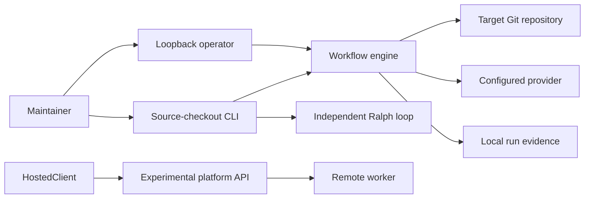

# System Overview

This is the short system-context reference. The canonical component, dependency,
runtime-flow, and state-ownership model lives in
[Architecture](../../ARCHITECTURE.md).

## Responsibilities

- The engine owns validated workflow execution and local run evidence.
- The operator owns loopback human control over allowed local repositories.
- Versioned contracts own cross-boundary data shapes.
- Ralph owns its separate story and filesystem-transaction lifecycle.
- The experimental platform owns hosted control-plane, lease, and artifact
  state; it is not a deployed service.
- Profiles, generated adapters, developer tools, and maintenance tools retain
  independent ownership and safety boundaries.

## Data and side effects

Tasks, workflow JSON, execution profiles, repository state, and operator actions
enter through the CLI or applications. The engine validates them before
launching provider processes or writing run state. Repository mutation occurs
only in the approved target worktree. Ralph does not share engine state. The
hosted platform stores its own experimental PostgreSQL, object-store, and lease
state.

## External interfaces

The deliberate interfaces are `scripts/src/rae.ts`, the `@rae/engine` export,
versioned schemas and persisted formats, workflow definitions, Ralph's CLI and
PRD, the operator's loopback `/api/v1`, and the platform's experimental
`/api/v2` and `/mcp`. Internal engine paths are not compatibility contracts.
The two HTTP APIs are not currently connected by a translation adapter.

## Limits

Local execution and deterministic fixtures are not evidence of a deployed
service, arbitrary provider performance, or universal superiority. The hosted
platform remains experimental.
